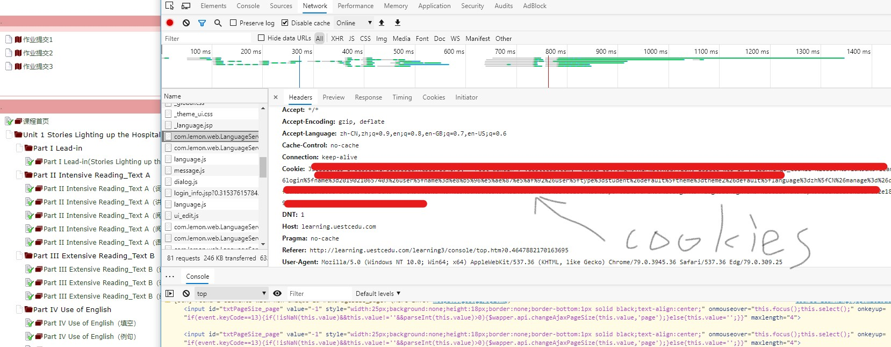
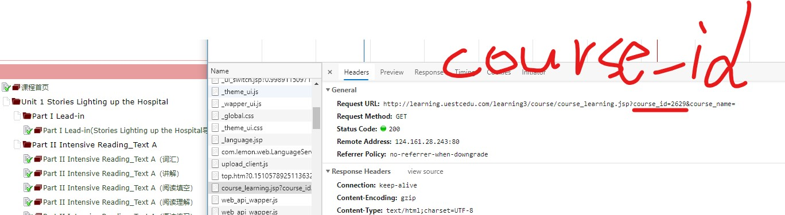
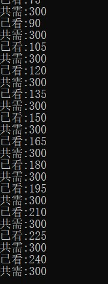

# dzkdks
DZKD挂课时代码

主要还是为了方便大家挂课时等问题，由于课程服务器有间隔时间监测，所有只能15秒提交一次，多提交无用。

# 操作方法
1. 浏览器登录课时页面
2. 按照要求找到cookies和course_id字段的信息

3. 有环境的用python3.x运行main.py文件，没环境的直接下载main.zip，解压运行main.exe的文件
4. 等着程序跑起来就行了

# bug：
1. 有些多页签多页面的课程需手动完成
2. 部分课程无法完成课时，也需要手动处理

# ps
大家有条件还是自学以下课程，老师讲解的还是很仔细的
代码仅用于内外研究学习
